# WPFPatientManagement

wpf로 작성한 환자 관리 애플리케이션입니다.

---

## 프로젝트 개요

- **개발 기간** : 2025.05 ~ 2025.07 (약 2개월)

- **개발환경** : Visual Studio 2022 / .NET 9.0 (WPF) / SQL Server Management Studio 20

- **사용기술** : C# / XAML / MSSQL / ADO.NET주요 기능

- **개발 형태** : 개인 프로젝트

- **아키텍처 및 디자인 패턴** : MVVM / Repository Pattern / Dependency Injection

- **사용 패키지(NuGet)** 
  
  - CommunityToolkit.Mvvm
  
  - Microsoft.Data.SqlClient
  
  - FontAwesome6.Svg
  
  - Microsoft.Extensions.DependencyInjection

---

## 화면 소개

**1. 메인 화면**

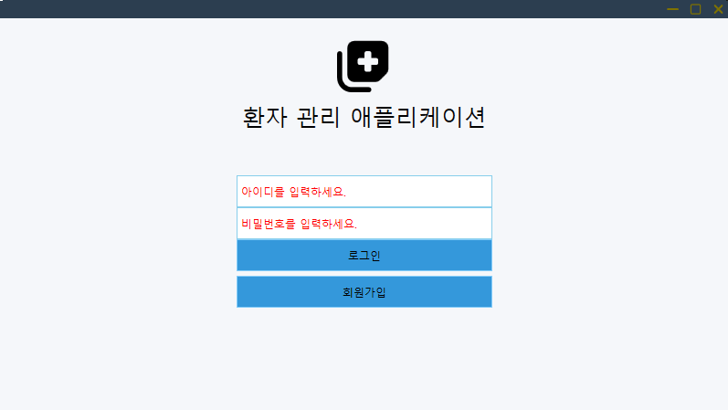

커스텀 타이틀 바 + 로그인 화면으로 구성

입력창 워터마크로 표시

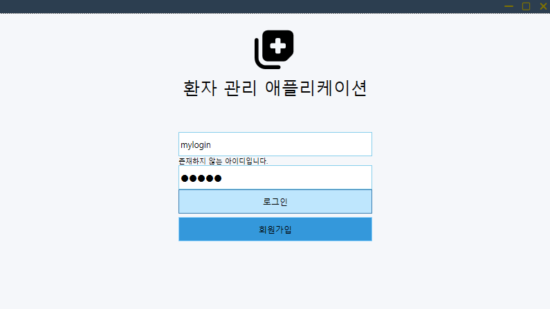

로그인 실패 시 오류 메시지 표시

입력한 사용자 정보에 따라 간호사 화면 또는 의사 화면으로 이동

**2. 간호사 화면**

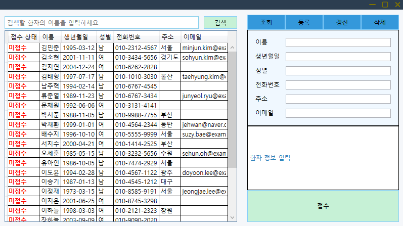

환자 리스트 + 환자 정보 CRUD + 의사 화면과 연결할 텍스트 및 버튼으로 구성

이름으로 환자 정보 검색

환자 클릭 시 환자 세부 정보 오른쪽에 표시

성별은 DataGrid에서 보이는 것과 저장되는 값 다르게 표시

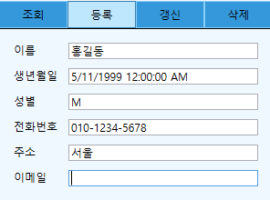

환자 정보 등록

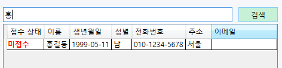

등록 완료된 환자 정보

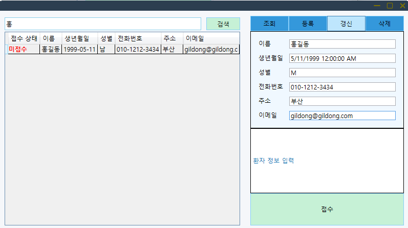

환자 정보 갱신

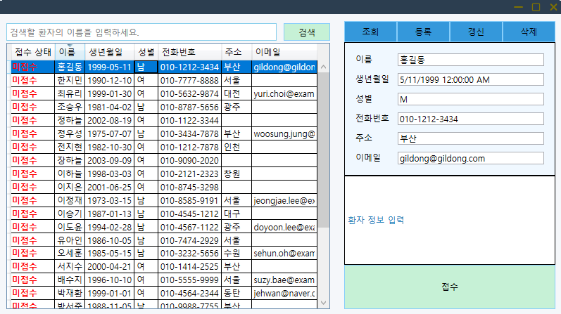

갱신된 환자 정보 표시

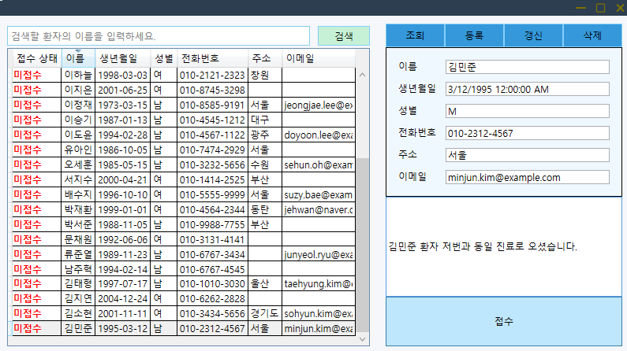

접수 내용 입력 후 접수 시도

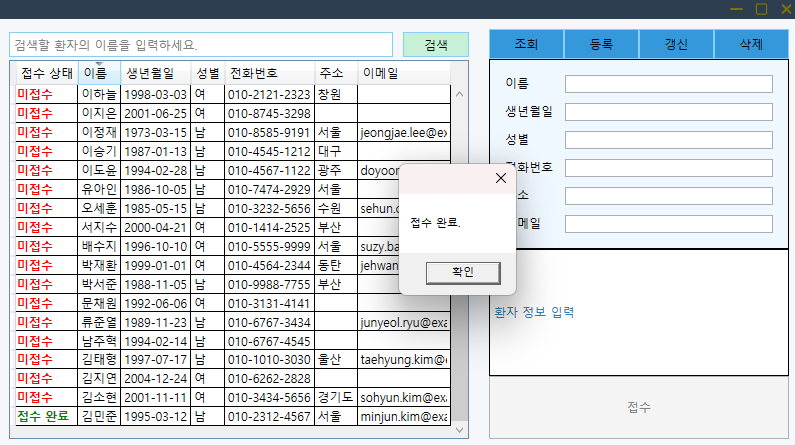

접수 완료 메세지 출력

- 환자 접수 상태 변경(색상 변경 및 텍스트 변경으로 시각적 UX 강화)

- 접수 내용 의사 화면으로 전달

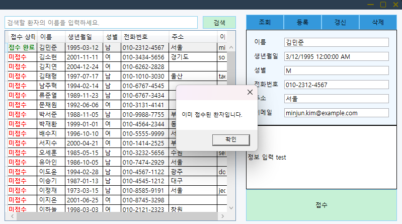

접수된 환자에 대해선 여러번 접수 하지 못 하도록 예외처리

**의사 화면 : 환자 리스트 + 진료 기록**

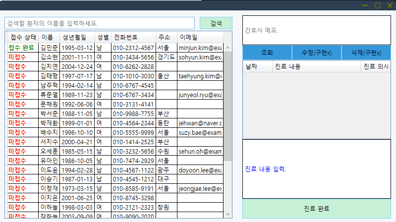

- 접수된 환자순으로 자동 정렬 되어 표시

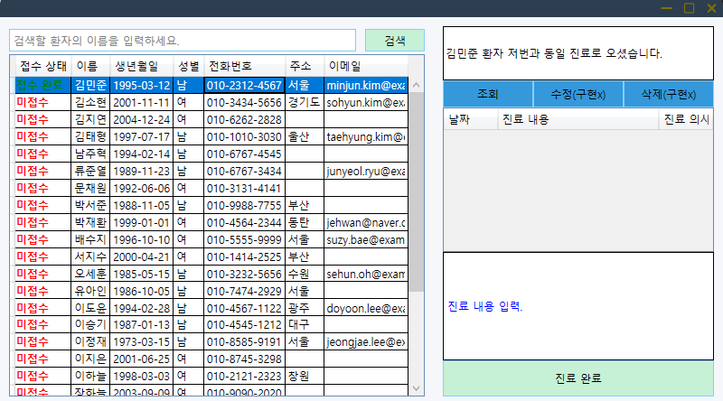

접수된 환자 클릭시 간호사 화면에서 넘어온 접수 정보 표시

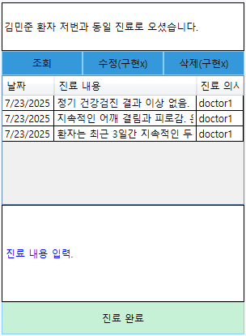

진료 기록 조회 (수정, 삭제는 아직 미구현)

- 현재 로그인 중인 의사 id가 진료한 의사로 입력

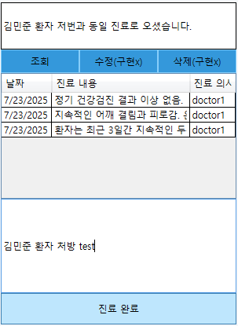

진료 내용 입력

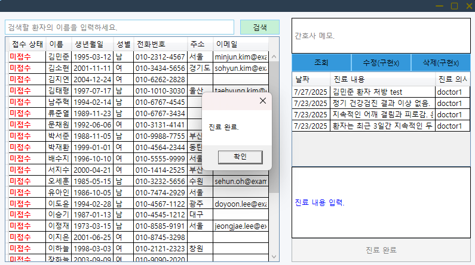

진료 완료 버튼 클릭시 접수 상태, 간호사 메모, 진료 내용 **데이터 실시간 업데이트**

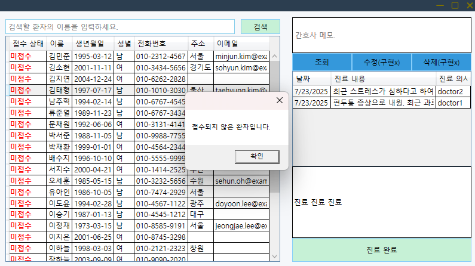

접수된 환자에 한에서 진료 가능

---

## DB 스키마

- USERS (사용자 테이블)

- PATIENTS (환자 정보 테이블)

- RECORD (진료 기록 테이블)

**ERD 구조**

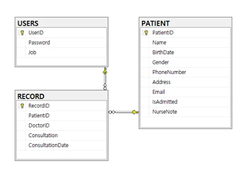
